#Лабораторне заняття №1: Ознайомлення з TypeScript

## Мета роботи
Ознайомитися з основами мови TypeScript шляхом виконання практичних завдань, що демонструють базові можливості мови: типізацію, інтерфейси, класи, композитні типи та дженерики.

---
## Пройдено розділ **"Швидкий старт React"** на офіційному сайті [React](https://react.dev/learn).  
У процесі опрацювання були вивчені такі основні поняття:
- JSX  
- функціональні компоненти  
- props  
- state  
- обробка подій  
- рендеринг списків  
- умовний рендеринг  
- односторонній потік даних (one-way data flow)  

---

## Скріншоти деяких виконаних робіт під час вивчення матеріалу (Quick Start)

### Робота №1
На першому етапі було створено прості компоненти, а саме створення кнопки (Button_Task1).  

*Приклад коду Button-компонента:*  
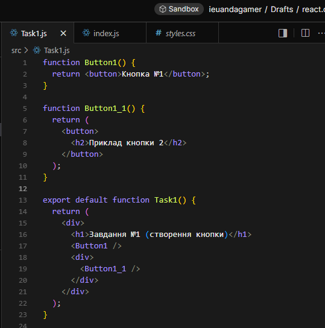

*Приклад роботи Button-компонента:*  
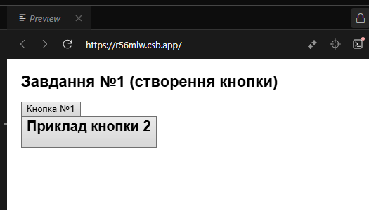

---

### Робота №2  
Наступним кроком стала реалізація написання розмітки з використанням JSX (JSX_Task2).  

*Приклад коду (.js) JSX-компонента:*  
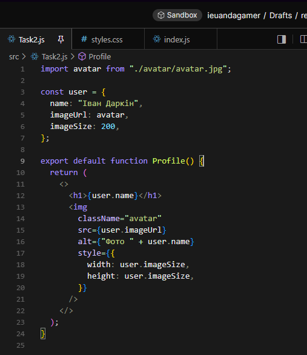

*Приклад коду (.css) JSX-компонента:*  
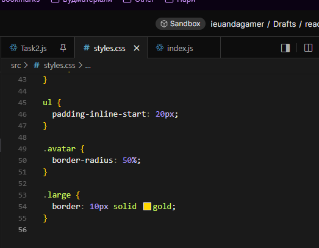

*Приклад роботи JSX-компонента:*  
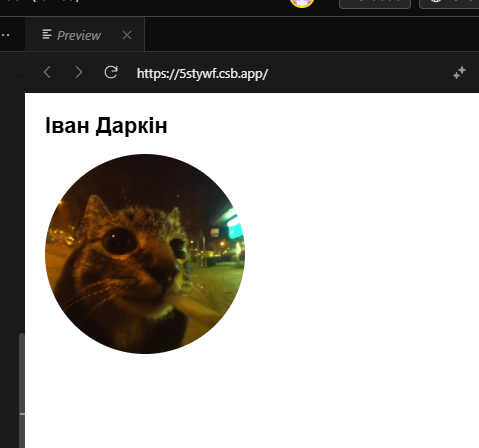

---

### Робота №3  
Наступною моєю роботою стало створення списку продуктів, де було використано відображення масиву даних у JSX (List_Task3).

*Приклад коду (.js) List-компонента::*  
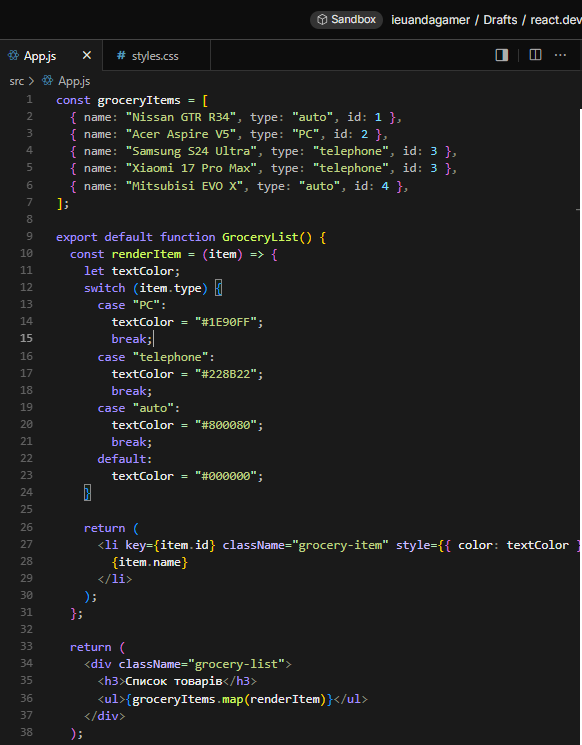

*Приклад коду (.css) List-компонента::*  
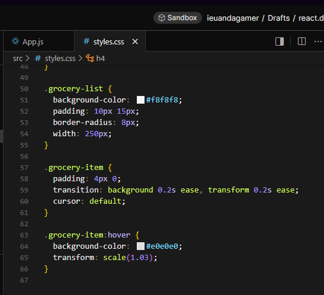

*Приклад роботи List-компонента:*  
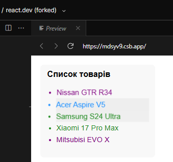

---

### Робота №4  
Останьою моєю роботою стало реалізація кнопок з реагуванням на події та із оновленням інформації на екрані у режимі реального часу (ClickTime_Task4).

*Приклад коду (.js) Click_time-компонента::*  
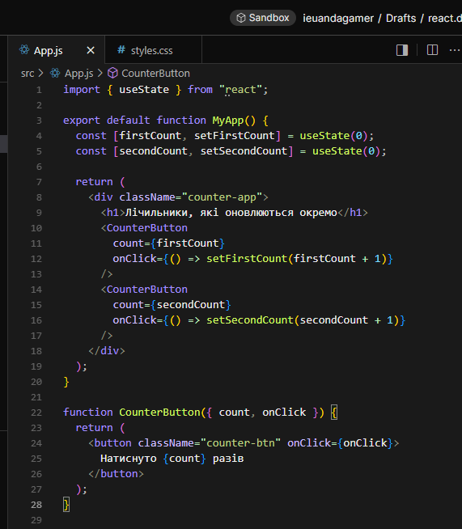

*Приклад коду (.css) Click_time-компонента::*  
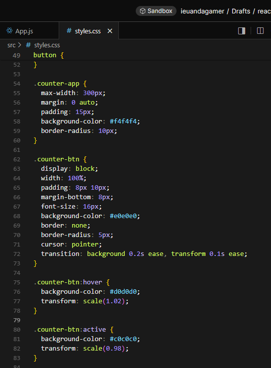

*Приклад роботи Click_time-компонента:*  
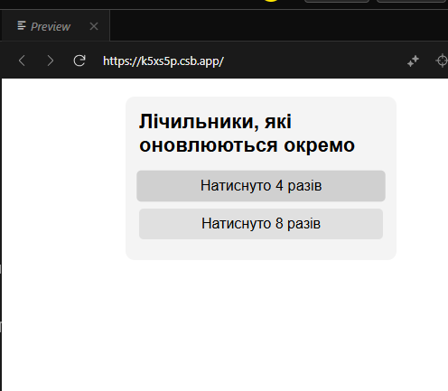

## Наступний пройдений розділ **"Tutorial: Tic-Tac-Toe"**

# Гра "Хрестики-нулики"

## Опрацювання та реалізація

Мною було реалізовано повноцінну гру **Tic Tac Toe (Хрестики-нулики)** з
використанням функціональних компонентів React та хуків `useState`.\
Реалізація відрізняється від класичного туторіалу --- додано візуальні
покращення та кілька зручних функцій для користувача.

## Основний функціонал

1.  **Поле 3×3** з клітинками (`Square`) для встановлення ❌ та ⭕.\

*Приклад коду:*  
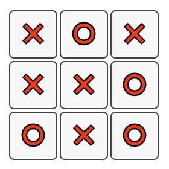

2.  **Підсвітка виграшної лінії** --- комірки, які утворили переможну
    комбінацію, виділяються зеленим кольором.\

*Приклад результата роботи:*  
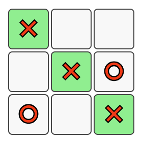

3.  **Відображення статусу гри**:
    -   чия черга ходити,
    -   оголошення переможця 🏆,
    -   повідомлення про нічию 🤝.\

*Приклад результата роботи:*  
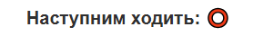

*Приклад результата роботи:*  
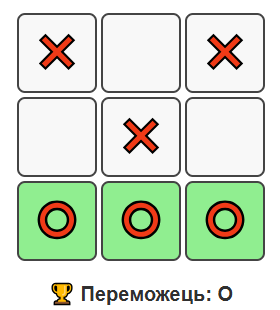

*Приклад результата роботи:*  
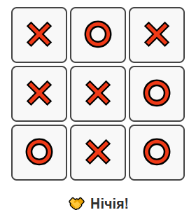

4.  **Кнопки керування**:
    -   ⬅ повернення на попередній хід,\
    -   🔄 рестарт гри,\
    -   📜 відображення історії ходів (активується після першого ходу).\

*Приклад результата роботи:*  
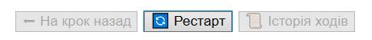

5.  **Історія гри**: можливість переглянути всі попередні ходи та
    повернутися на будь-який з них.

*Приклад результата роботи:*  
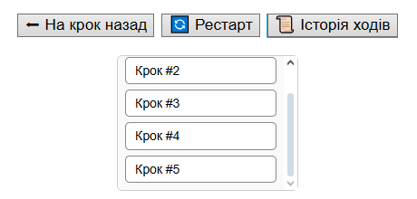

## Візуальне оформлення

-   Клітинки мають приємний вигляд із плавною анімацією наведення.\
-   Активні ходи підсвічуються.\
-   Панель управління та історія оформлені у вигляді акуратних блоків із
    кнопками.

## Що було зрозуміло та легко

-   Логіка визначення переможця (`calculateWinner`) та побудова
    компонента `Board`.\
-   Використання `map` для рендерингу рядків і клітинок.\
-   Використання хуку `useState` для управління історією та поточним
    станом гри.

## Які питання/складнощі виникли

-   Реалізація **історії ходів**, щоб вона виглядала охайно й не
    вибивалась з інтерфейсу.\
-   Організація кількох станів (`history`, `currentMove`, `showHistory`)
    одночасно.\
-   Створення механізму підсвітки виграшної лінії.

## 📝 Короткий опис роботи
- **Було зрозуміло та легко виконувати:**  
  створення простих компонентів, робота з JSX, стилізація через CSS, робота зі списками.
  
- **Викликало складнощі:**  
  початкове налаштування середовища, правильне підключення локальних зображень, реалізація логіки для гри «Хрестики-нулики».

- **Цікавою частиною було:**  
  реалізувати функціонал збереження історії ходів у Tic Tac Toe, можливість повернення на попередній крок та підсвітка виграшної лінії.

## 📌 Висновок
Робота допомогла закріпити базові знання React та зрозуміти підхід до створення інтерактивних інтерфейсів.
